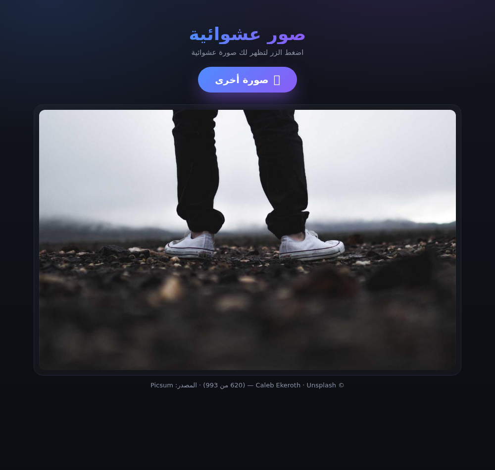

# 🖼️ صور عشوائية — Random Images Site

موقع بسيط جداً: **زر واحد** («فتح الصورة»)، وعند الضغط عليه تظهر **صورة عشوائية من المصدر المحدَّد**.
الصور تأتي من الإنترنت مباشرة — لا يُخزَّن أي ملف على الاستضافة.

| | الرابط |
|---|---|
| 🌍 **الموقع المباشر** | https://random-images-site.vercel.app |
| 📦 **المستودع** | https://github.com/elias0878/random-images-site |



---

## ⚠️ ملاحظة مهمة عن الشبكات المحجوبة

بعض مزوّدي الإنترنت (في اليمن وغيرها) **يحجبون شبكات CDN** مثل Fastly التي تُقدَّم منها الصور،
فتفتح الصفحة لكن **لا تظهر أي صورة**.

**الحلّ المطبَّق:** الصور وقوائمها تُمرَّر عبر **نطاق الموقع نفسه** (`/api/img` و `/api/data`)،
وهو نطاق يفتح عندك بلا مشكلة. الصور **لا تُخزَّن** — تُجلب لحظياً من المصدر ثم تُسلَّم لمتصفحك،
مع كاش مؤقت على شبكة Vercel فقط (لا على جهازك ولا في المستودع).

```
متصفحك → /api/img?u=<رابط الصورة في المصدر> → المصدر → متصفحك
```

لإيقاف التمرير والجلب مباشرة من المصدر: اجعل `useProxy: false` في `config.js`.

---

## المصدر

يُحدَّد من ملف **`config.js`** — وتأتي الصور من هذا المصدر **فقط**، ولا يُخلط معه غيره:

```js
window.SITE_CONFIG = {
  source: 'picsum',    // المصدر الوحيد
  useProxy: true,      // تمرير الصور عبر نطاقنا (يحلّ الحجب)
  ...
};
```

| المصدر | الحجم | الربط المباشر | CORS |
|---|---|---|---|
| **`picsum`** *(الافتراضي)* | **993 صورة** | ✅ مسموح | ✅ `*` |
| `wikimedia` | 176–330 صورة | ✅ مسموح | ✅ `*` |
| `folder` | حسب مجلد `images/` | — | — |

### الإعدادات
```js
picsum: {
  pages: 10,        // 10 × 100 = 993 صورة (الحد الفعلي المتاح)
  limitPerPage: 100,
  width: 1200,      // أبعاد الصورة (أصغر = أسرع على الشبكات البطيئة)
  height: 750,
  format: 'jpg',    // أو 'webp' (أصغر حجماً)
  cacheHours: 12
}
```

---

## الأمان في دالتي التمرير

`api/img.js` و `api/data.js` **لا يعملان كوسيط مفتوح**:

| الاختبار | النتيجة |
|---|---|
| `https://evil.example.com/x.jpg` | ❌ 403 |
| `https://picsum.photos.evil.com/x.jpg` | ❌ 403 (منع خداع النطاق) |
| `http://picsum.photos/x.jpg` | ❌ 400 (https فقط) |
| `https://pastebin.com/raw/...` | ❌ 403 |
| `https://picsum.photos/id/217/1200/750` | ✅ 200 |

بالإضافة إلى: حدّ أقصى لحجم الملف (6MB)، وفحص أن المحتوى صورة فعلاً، وحماية من إعادة التوجيه.

---

## كيف يعمل؟

```
config.js            ← المصدر المحدَّد
    ↓
app.js               ← يجلب قائمة كبيرة (993 صورة) ويرتّبها في ذاكرة المتصفح 12 ساعة
    ↓
الضغط على الزر       ← اختيار عشوائي + جلب الصورة عبر /api/img وعرضها
    ↓
api/img.js           ← يجلب الصورة من المصدر (نطاقات مسموح بها فقط) ويسلّمها
```

**سلوك مضمون:**
- الصور من **المصدر المحدَّد فقط** — لا خلط بين مصادر
- **لا تكرار** لنفس الصورة على التوالي
- **خطة احتياطية**: لو فشل جلب القائمة، يجلب صورة عشوائية من **نفس المصدر** — الزر لا يتوقف
- إعادة محاولة تلقائية لو فشل تحميل صورة
- دائرة الانتظار تختفي بمجرد ظهور الصورة

---

## البنية

| الملف | الوظيفة |
|---|---|
| `index.html` | الصفحة — زر «فتح الصورة» فقط |
| `styles.css` | التصميم |
| `config.js` | **الإعدادات: المصدر، التمرير، الأبعاد** |
| `app.js` | منطق الجلب والاختيار العشوائي |
| `api/img.js` | تمرير الصور عبر نطاقنا (مع قائمة نطاقات مسموح بها) |
| `api/data.js` | تمرير قوائم الصور (JSON) |
| `scripts/build.mjs` | بناء النشر (يجهّز `public/`) |
| `scripts/build-index.mjs` | فهرس مجلد `images/` |
| `scripts/make-preview.mjs` | ينشئ `preview.html` للمعاينة بلا إنترنت |
| `scripts/add-images.sh` | إضافة صور من مجلد/ملف مضغوط |
| `scripts/optimize-images.py` | تصغير حجم الصور (اختياري) |
| `scripts/restore-git.sh` | إعادة إعدادات git المحلية + الرفع |

## المعاينة محلياً

```bash
npm run dev      # http://localhost:3000
```

## استخدام صورك الخاصة

بدّل المصدر إلى `'folder'` في `config.js`، ثم:
```bash
# من موقع GitHub: images → Add file → Upload files
# أو محلياً:
cp ~/pictures/* images/ && npm run build && git add -A && git commit -m "صور" && git push
```

ميزة إضافية: الصور من مجلدك تُقدَّم **من نطاق Vercel نفسه** — فلا تتأثر بأي حجب لشبكات CDN.

---

## ملاحظات

- **عن perchance.org:** لا يمكن استخدامه كمصدر — لا API رسمي، ولا ترويسات CORS (المتصفح ممنوع من الجلب)، والصور تُعاد كبيانات مضمّنة `data:image/...` داخل iframes بلا رابط قابل للربط.
- **Picsum** = صور Unsplash مجانية الاستخدام، ويُعرض اسم المصوّر أسفل الصورة.
- صور ويكيميديا برخص حرة (CC).
